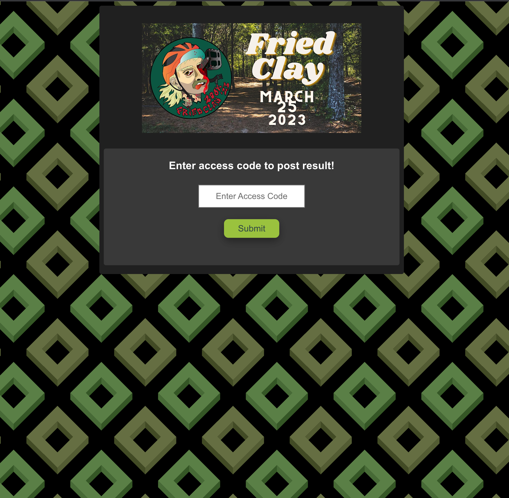
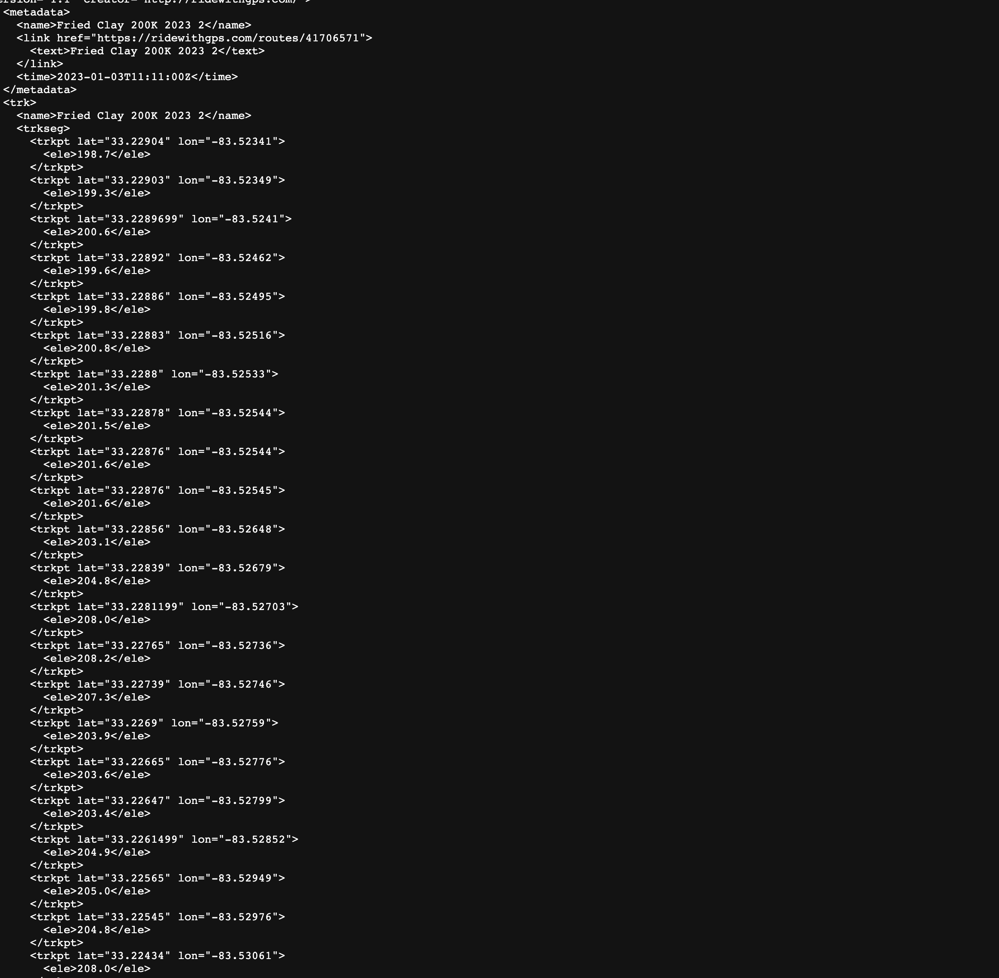
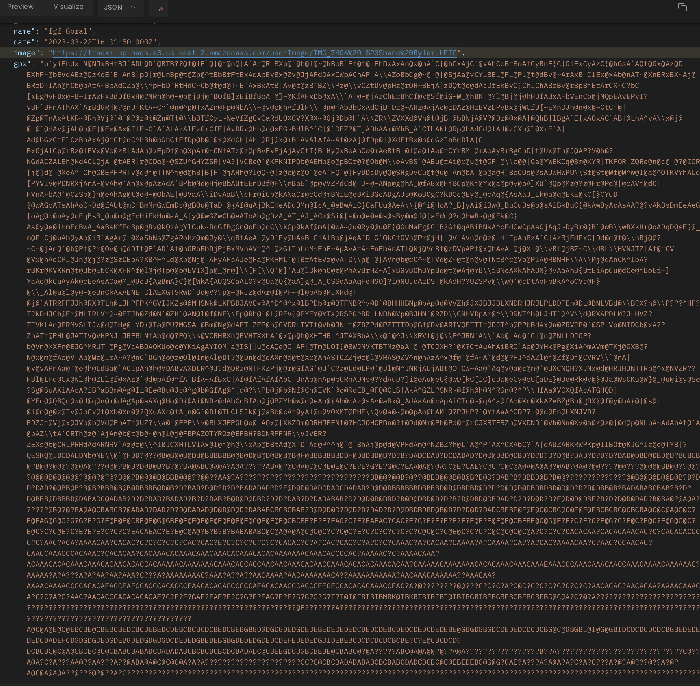
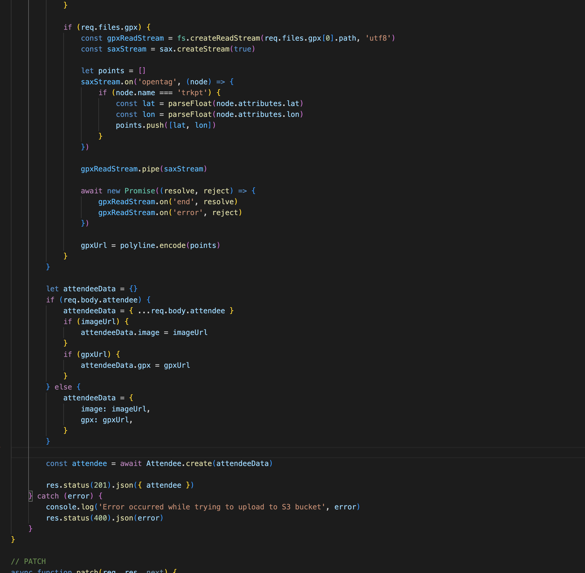
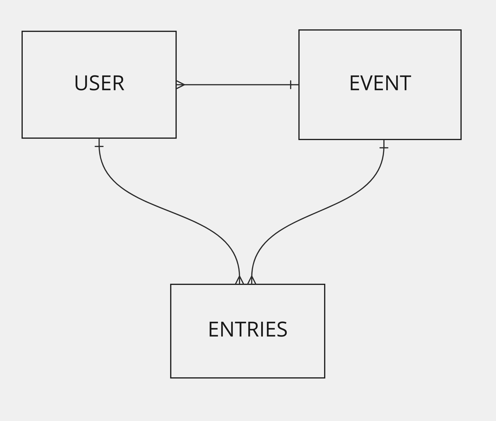

# Fried Clay Leaderboard
## An Adventure Race Scoring App

 

### FriedClay.com is a web app designed to create an interactive leaderboard for self-supported adventure races

<table>
<tr>
<td>
Many adventure races don't have a timing system in place.  To verify your placing, most races require a GPX file upload which shows your exact GPS track that you followed during the event.  As an organizer of such event, I have relied on spreadsheets and Google Forms for participants to submit their results in the past.  This app allows users to enter their information, and submit files for automatic scoring.  It also allows participants to see their position updated live.
</td>
</tr>
</table>

## Getting Started:

### See the deployed app here: [Friedclay.com](https://friedclay.com/)
### See the server source code: [Server Source Code](https://github.com/Patgoral/TRACKR-server2)

<table>
<tr>
<td>
  Upon loading the page, you are prompted to sign in or sign up for the service.  Once registered and signed in, you will view a leaderboard of eveyone who has already submitted their results.  Clicking the "Submit Your Time" button will allow you to enter your name, time, and upload both an image and GPX file.  If you click on any name on the leaderboard it will show you the details for that participant along with the photo and GPX map data.
</td>
</tr>
</table>

---
## Screenshots

 |
 

 |
  |

---

## Technologies Used

| Code       |           |
| ---------- | --------- |
| React      | Express   |
| JavaScript | Node      |
| HTML5      | Mongoose  |
| MongoDb    | CSS3      |
| leaflet    | Amazon S3 |

---
## Challenges

<table>
<tr>
<td>
  This project had a few major challenges I had to deal with to make it functional.  GPX files are massive XML files that list individual lat/long coordinates, a timestamp, and an elevation point for each unique point on a track.  With this event being 130 miles long, these files created a huge data problem.  This image shows a clip of what the GPX file looked like:
</td>
</tr>
</table>
 

<table>
<tr>
<td>
  Once I got the server to handle the upload of these files, my load times were terrible.  The payload for only 5 uploads was over 1.4 million lines of code, and the page would take roughly 15 seconds to load.  I did some research and found a package called GPX parser which broke that array down into only the lat/long coordinates.  This sped things up, but only by about 2 seconds.  From there I found a technology called encoded Polyline.  This allowed me to take the parsed information, and convert it into an encoded string, which was then decoded once it hit the map component on the front end.
</td>
</tr>
</table>

 

<table>
<tr>
<td>
This sped things up considerably, but since there was so much happening on the server side post request, it would crash the server upon upload.  To handle this I ran yet another parser called Sax to break down the read stream into chunks and make the function far more efficient.  This entire process took the initial payload for 5 uploads from 1.4 million lines, down to around 50.  This also took page render times from 15 seconds down to less than one second. 
</td>
</tr>
</table>

 

---
## Entity Relationship Diagram

 

---

## Future Goals:

#### Version 2:

-As a user I want to sort the leaderboard based on different params (age, gender, etc.)

-As a user I want to be share my results on social media

-As a user I want to have a search function for attendees

-As an admin I want to be able to manage submissions

#### Version 3:

-As a user I want to see a map that live tracks based on gps position

-As an admin I want to be able to create multiple events

-As a user I want to be able to submit more info (bike details, etc.)