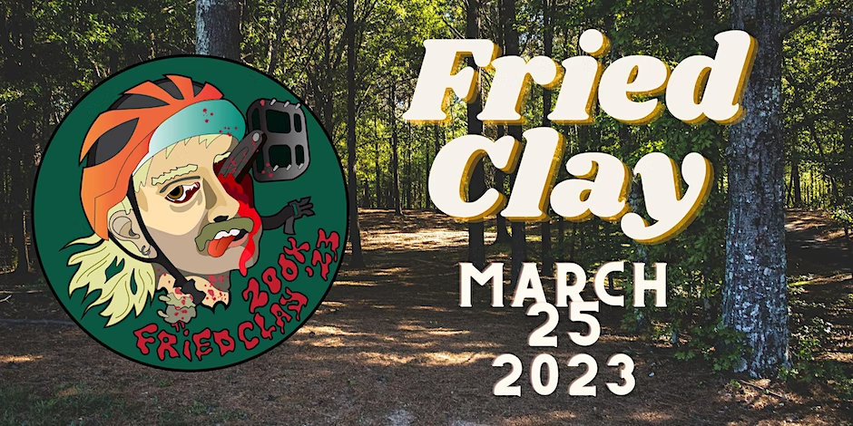
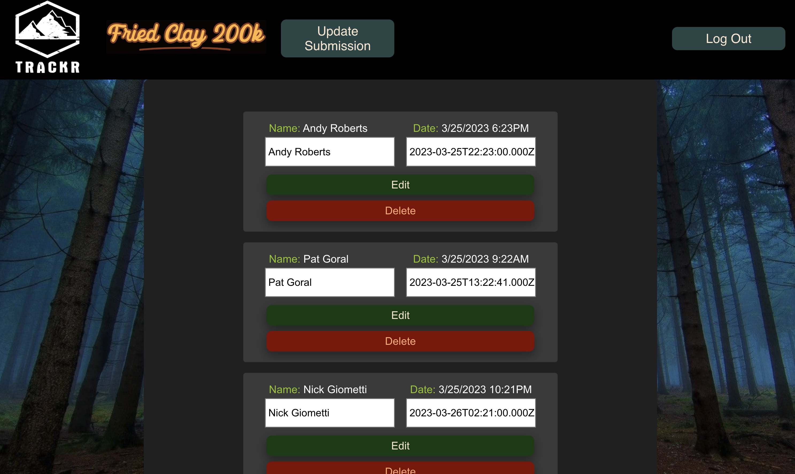

# TRACKR
## An Adventure Race Scoring App

 

### TRACKR is a web app designed to create an interactive leaderboard for self-supported adventure races

<table>
<tr>
<td>
Many adventure races don't have a timing system in place.  To verify your placing, most races require a GPX file upload which shows your exact GPS track that you followed during the event.  As an organizer of such event, I have relied on spreadsheets and Google Forms for participants to submit their results in the past.  This app allows users to enter their information, and submit files for automatic scoring.  It also allows participants to see their position updated live.
</td>
</tr>
</table>

## Getting Started:

### See the deployed app here: [Trackr App](https://trackr-client.onrender.com/)

<table>
<tr>
<td>
  Upon loading the page, you are prompted to sign in or sign up for the service.  Once registered and signed in, you will view a leaderboard of eveyone who has already submitted their results.  Clicking the "Submit Your Time" button will allow you to enter your name, time, and upload both an image and GPX file.  If you click on any name on the leaderboard it will show you the details for that participant along with the photo and GPX map data.
</td>
</tr>
</table>

---
## Screenshots

 |
 

 |
  |

---

## Technologies Used

| Code       |           |
| ---------- | --------- |
| React      | Express   |
| JavaScript | Node      |
| HTML5      | Mongoose  |
| MongoDb    | CSS3      |
| leaflet    | Amazon S3 |

---

## Future Goals:

#### Version 2:

-As a user I want to sort the leaderboard based on different params (age, gender, etc.)

-As a user I want to be share my results on social media

-As a user I want to have a search function for attendees

-As an admin I want to be able to manage submissions

#### Version 3:

-As a user I want to see a map that live tracks based on gps position

-As an admin I want to be able to create multiple events

-As a user I want to be able to submit more info (bike details, etc.)