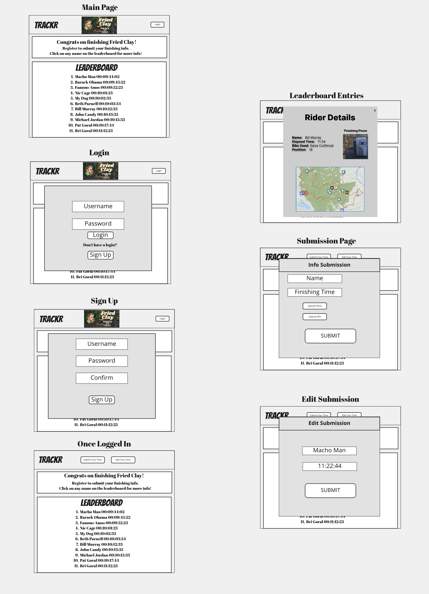

# TRACKR
## An Adventure Race Scoring App

 

### TRACKR is a web app designed to create an interactive leaderboard for self-supported adventure races
---
## Entity Relationship Diagram

 

---
## Wireframe

 

---

## Planning Docs:
---

### Trello Board:

[View Trello Board](https://trello.com/b/Od0prVVK/race-tracker)

---

## Planned Technologies

| Code       |           |
| ---------- | --------- |
| React      | Django    |
| JavaScript | Python    |
| HTML5      | PostgreSQL|
| Mongoose   | CSS3      |

## MVP:

### Version 1:
-As a user I want to view the home page with a Navbar, list of entries, and login/signup prompt.

-As a user I want to see the list of entries listed in order of finish time.

-As a user I want to be able to click on each entry to see details

-As a user I want to see the name, finish time, elapsed time, finishing photo, and gpx track in the entry detail page.

-As a user I want to be able to sign up or login

-As a user, once logged in I want to be able to submit my own entry.

-As a user I want my entry to consist of Name, Finished date/time, and upload a photo and a GPX file

-As a user, I want to be able to update or delete my entry

## Future Goals:

#### Version 2:

-As a user I want to sort the leaderboard based on different params (age, gender, etc.)

-As a user I want to be share my results on social media

-As a user I want to have a search function for attendees

-As an admin I want to be able to manage submissions

#### Version 3:

-As a user I want to see a map that live tracks based on gps position

-As an admin I want to be able to create multiple events

-As a user I want to be able to submit more info (bike details, etc.)